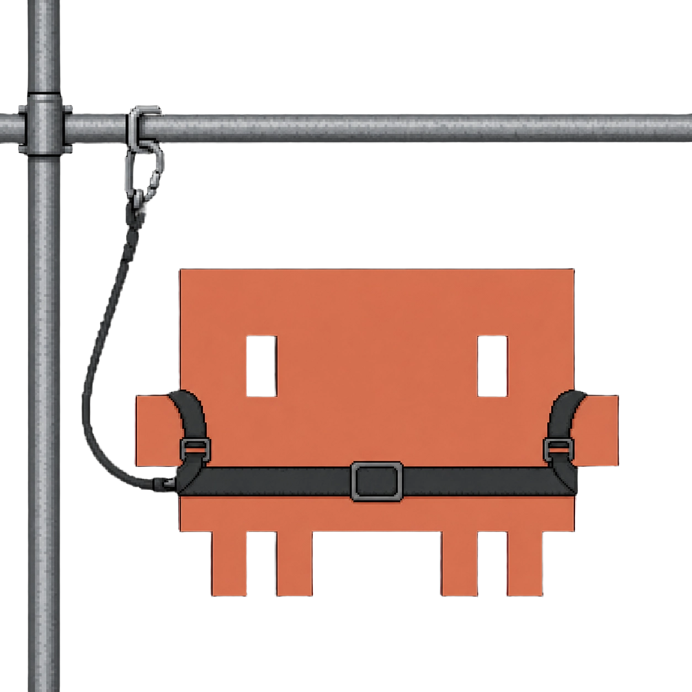
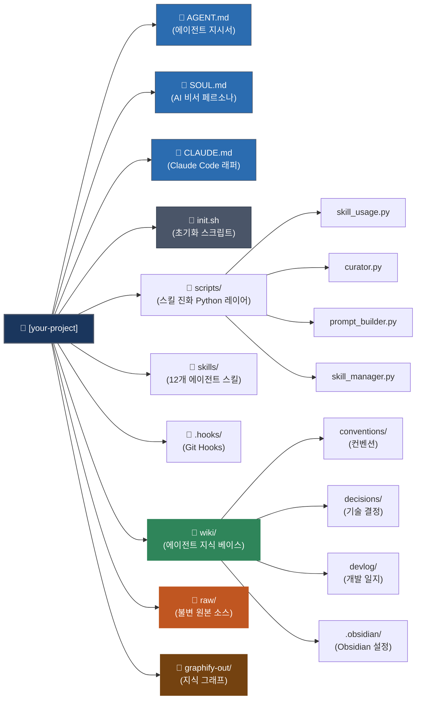

<p align="center">
  
</p>

# project-scaffold

> AI 에이전트와 함께 개발하는 모든 프로젝트를 위한 LLM Wiki 기반 개발 하네스 템플릿

[](./AGENT.md)
[](https://www.gnu.org/software/bash/)
[](https://gist.github.com/karpathy/442a6bf555914893e9891c11519de94f)
[](https://obsidian.md)
[](https://python.org)


<p align="center"><a href="README.md">English</a> | 한국어</p>

---

## 목차

1. [개요](#개요)
2. [빠른 시작](#빠른-시작)
3. [왜 만들었나](#왜-만들었나)
4. [LLM Wiki란?](#llm-wiki란)
5. [Hermes Agent에서 영감을 받다](#hermes-agent에서-영감을-받다)
6. [oh-my-openagent와의 차별점](#oh-my-openagent와의-차별점)
7. [멀티 에이전트 호환이 필요한 이유 — 2026년 6월 Fable 5 사태](#멀티-에이전트-호환이-필요한-이유--2026년-6월-fable-5-사태)
8. [시스템 구조](#시스템-구조)
9. [사용자 vs 시스템 역할 분리](#사용자-vs-시스템-역할-분리)
10. [핵심 기능](#핵심-기능)
11. [설계 원칙](#설계-원칙)
12. [도구 연동](#도구-연동)
13. [프로젝트 구조](#프로젝트-구조)
14. [현재 상태](#현재-상태)

---

## 개요

project-scaffold는 소프트웨어 개발 프로젝트에 **AI 에이전트 하네스**를 구축하는 GitHub 템플릿이다.

AI 에이전트는 강력하지만 컨텍스트가 없으면 매번 같은 실수를 반복한다. 팀 컨벤션을 모르고 지난 결정을 기억하지 못하며 코드리뷰 기준도 없다. project-scaffold는 이 문제를 **에이전트가 스스로 읽고 따르는 살아있는 wiki**로 해결한다.

[Andrej Karpathy가 제안한 LLM Wiki 패턴](https://gist.github.com/karpathy/442a6bf555914893e9891c11519de94f)을 기반으로 하며, RAG 없이 에이전트가 소유·유지하는 마크다운 wiki가 프로젝트 전체의 단일 진실 소스가 된다.

---

## 빠른 시작

### 새 프로젝트

**1 — GitHub 템플릿으로 새 레포 생성 후 클론:**

```bash
git clone https://github.com/<your-name>/<your-project>.git
cd <your-project>
```

**2 — 초기화 — 모드 1 선택, 에이전트 선택:**

```bash
bash init.sh
```

**3 — AI 에이전트에서 인터뷰 시작:**

> 터미널이 아니라 AI 채팅(Claude Code, Cursor 등) 안에서 입력해.

```
/setup
```

### 기존 프로젝트에 설치

**1 — project-scaffold를 설치 도구로 클론:**

```bash
git clone https://github.com/taejung3852/project-scaffold.git
cd project-scaffold
```

**2 — 초기화 — 모드 2 선택, 기존 프로젝트 경로 입력:**

```bash
bash init.sh
```

> 기존 프로젝트 경로를 물어보면 전체 경로를 입력해 (예: `/Users/me/workspace/MyProject`). 그냥 Enter 치면 project-scaffold 자신을 가리키게 돼서 안 됨.

**3 — 기존 프로젝트를 AI 에이전트에서 열고 인터뷰 시작:**

> 터미널이 아니라 AI 채팅(Claude Code, Cursor 등) 안에서 입력해.

```
/setup
```

`init.sh` 실행 시 사용할 AI 에이전트를 선택한다. 복수 선택 가능하며 `all` 입력 시 전체 적용된다.

| 번호 | 에이전트 | 스킬 경로 | 방식 |
|---|---|---|---|
| 1 | Claude Code | `.claude/skills/` | 심링크 |
| 2 | Codex CLI | `.agents/skills/` | 심링크 |
| 3 | Antigravity | `.agents/skills/` | 심링크 (Codex와 경로 공유) |
| 4 | Windsurf | `.windsurf/skills/` | 심링크 |
| 5 | Cursor | `.cursor/rules/` | `.mdc` 변환 생성 |
| 6 | Continue.dev | `.continue/prompts/` | `.md` 변환 생성 |
| 7 | Hermes | `.hermes/skills/` | 심링크 + `cli-config.yaml` `external_dirs` 등록 + `.hermes.md` |
| 8 | Aider | `.aider.conf.yml` | `read:` 목록 추가 |

나중에 에이전트를 추가하거나 바꾸고 싶으면 `bash add-agent.sh`를 실행하면 된다.

`/setup`은 중간에 중단해도 완료된 카테고리가 보존된다. 나중에 이어서 진행하면 된다.

---

## 왜 만들었나

### 문제 정의

AI 코딩 에이전트를 프로젝트에 도입할 때 가장 큰 장벽은 **"에이전트가 우리 팀처럼 행동하게 만드는 것"**이다.

- 커밋 메시지 형식이 매번 다르다
- 아키텍처 레이어 규칙을 무시한다
- 테스트 없이 구현 코드부터 짠다
- 지난 회의에서 결정한 내용을 알 방법이 없다

프롬프트로 매번 설명하는 건 확장되지 않는다. 대화가 끝나면 사라진다.

### 해결 방안

팀 컨벤션을 **구조화된 wiki로 문서화**하고 에이전트가 작업마다 해당 wiki를 읽고 따르게 한다. `/setup` 인터뷰로 프로젝트 고유의 규칙을 정의하면 git hook으로 위반을 차단하며 devlog가 자동으로 쌓인다.

> **핵심 아이디어**: 에이전트에게 규칙을 외우게 하는 대신, 에이전트가 언제든 꺼내 읽는 장소를 만든다.

---

## LLM Wiki란?

LLM Wiki는 Andrej Karpathy가 제안한 지식 관리 패턴이다. ([원문 Gist](https://gist.github.com/karpathy/442a6bf555914893e9891c11519de94f))

### 구조

3개의 레이어로 구성된다:

| 레이어 | 경로 | 소유자 | 역할 |
|---|---|---|---|
| **원본** | `raw/` | 사람 | 불변 소스. 회의록·결정사항·기사·코드 스니펫 등 |
| **Wiki** | `wiki/` | AI 에이전트 | 원본을 읽고 컴파일한 구조화된 지식 |
| **Schema** | `AGENT.md` | 사람+AI | 에이전트 동작 규칙 정의 |

### 3가지 오퍼레이션

- **Ingest**: 새 원본 추가 → 에이전트가 요약 페이지 생성, 기존 wiki 페이지 업데이트, 상호참조(wikilink) 유지
- **Query**: wiki 페이지 탐색 → 종합 답변 제공 → 가치 있는 결과는 `wiki/synthesis/`에 저장
- **Lint**: 주기적 건강 점검 → 고아 페이지·깨진 링크·모순·stale 정보 탐지

### RAG 대신 LLM Wiki를 쓰는 이유

> *"원본 문서는 매번 재검색되지 않는다. 지식이 컴파일되어 한 번 유지되고, 쿼리마다 다시 도출되지 않는다."*
> — Andrej Karpathy

RAG는 쿼리마다 원본 문서를 벡터 검색하고 LLM이 매번 같은 추론을 반복한다. LLM Wiki는 이미 구조화된 wiki에서 답변한다. 추론이 한 번만 일어나고, 그 결과가 wiki에 축적된다.

| | RAG | LLM Wiki |
|---|---|---|
| 지식 저장 | 벡터 DB (임베딩) | 마크다운 파일 (읽을 수 있는 텍스트) |
| 추론 시점 | 쿼리마다 | Ingest 시 한 번 |
| 상호참조 | 유사도 기반 | 명시적 `[[wikilink]]` |
| 유지보수 | 재인덱싱 필요 | `/wiki-lint` 으로 점검 |
| 인프라 | Vector DB 서버 | Git 저장소 |

### 왜 project-scaffold에 채택했나

- 소프트웨어 팀의 컨벤션·결정·회의록은 한번 정리되면 자주 바뀌지 않는다 → RAG의 재검색 이점이 없음
- 에이전트가 컨벤션 wiki를 직접 읽고 따르는 것이 벡터 검색으로 찾는 것보다 정확하고 신뢰도가 높다
- Git으로 버전관리되어 히스토리 추적과 팀 협업이 무료로 따라온다
- Vector DB 없이 마크다운 파일만으로 동작하므로 어떤 AI 에이전트에도 에코시스템 종속 없이 적용된다

---

## Hermes Agent에서 영감을 받다

[NousResearch](https://nousresearch.com/)는 Hermes·Nous-Capybara 등 파인튜닝 모델 시리즈로 오픈소스 AI 커뮤니티에서 잘 알려진 연구 조직이다. [NousResearch/hermes-agent](https://github.com/NousResearch/hermes-agent)는 이 조직이 만든 **스킬 기반 자가 진화 에이전트 하네스**다.

핵심 문제 의식: 에이전트가 오래 쓰일수록 스킬이 누적되고 중복이 생기며 사용 패턴이 바뀐다. **스킬 생태계 자체가 진화해야 한다.** Hermes는 이 문제를 4개의 Python 레이어로 해결한다.

| Hermes 구성 요소 | 역할 |
|---|---|
| `skill_usage.py` | 스킬 호출마다 사용 데이터를 JSON에 기록 |
| `curator.py` | 사용 데이터를 읽어 stale/archive 판정 + 진화 리포트 생성 |
| `prompt_builder.py` | 사용 패턴 기반으로 에이전트 지시서에 권고 사항을 동적 주입 |
| `skill_manager.py` | 스킬 생성·아카이브·복원 CRUD |

**왜 이 메커니즘을 도입했나:**

스킬은 `.md` 파일로 작성되어 선언적이고 에이전트 무관하지만, 사용 추적·상태 전이·파일 이동 같은 결정론적 로직은 코드로 처리해야 한다. Hermes의 4-레이어 구조는 이 경계를 명확하게 분리한다 — **선언(`SKILL.md`)은 에이전트가, 판정(`curator.py`)은 Python이** 담당한다.

project-scaffold는 이 구조를 그대로 채택했다. 스킬을 많이 쓸수록 `skills/.usage.json`에 데이터가 쌓이면 `prompt_builder.py`가 `AGENT.md`의 권고 섹션을 자동 갱신한다. `/curate` 스킬이 LLM 판단으로 통합·정리하는 것도 같은 흐름이다.

또한 Hermes의 `SOUL.md` 개념도 도입했다. Hermes에서 SOUL.md는 에이전트의 페르소나를 정의하는 파일로, `/setup`이 `AGENT.md`를 갱신해도 변하지 않는 영구 설정이다. project-scaffold에서는 **개발자가 원하는 AI 비서의 성격**을 여기에 정의한다 — 말투, 전문성 가정, 피드백 방식, 불확실할 때의 행동 방식. 프로젝트가 바뀌어도 비서의 성격은 유지된다.

---

## oh-my-openagent와의 차별점

[oh-my-openagent (OmO)](https://github.com/code-yeongyu/oh-my-openagent)는 한국인 개발자 code-yeongyu가 $24,000 상당의 토큰을 직접 소비해 모든 에이전트 도구를 테스트한 끝에 만든 오픈소스 에이전트 하네스다. **2025년 12월 생성 후 6개월 만에 GitHub Stars 62,000+** 를 달성했으며, Google·Microsoft·Vercel 엔지니어들이 사용하는 도구로 알려져 있다.

OmO의 핵심 혁신:
- **Hash-Anchored Edits** — 모든 줄에 콘텐츠 해시 태그를 부착해 에이전트 에디트 성공률을 6.7% → 68.3%로 끌어올렸다
- **Ralph Loop** — 100% 완료까지 멈추지 않는 자기 참조 오케스트레이션
- **멀티 모델 팀** — Sisyphus(Claude), Hephaestus(GPT-5), Prometheus, Oracle 등 11개 전문 에이전트가 태스크 카테고리별로 최적 모델을 배정받아 병렬 실행된다

OmO와 project-scaffold를 비교하면:

| | oh-my-openagent (OmO) | project-scaffold |
|---|---|---|
| 방향 | **엑셀러레이터** — 에이전트에게 폭넓은 도구와 권한 | **가드레일** — 에이전트 오작동·규칙 위반 통제 |
| 대상 | 빠른 프로토타이핑 (1인·소규모팀) | 현업 협업팀 |
| 지식 관리 | 없음 | LLM Wiki (`wiki/` 레이어) |
| devlog | 없음 | 커밋마다 자동 생성 (post-commit 훅) |
| 컨벤션 강제 | 없음 | Hard(훅) + Soft(AGENT.md) 2-레이어 |
| 하네스 중립성 | OpenCode 하네스 기반 (Claude Code는 호환 레이어 별도 제공) | `AGENT.md` 단일 소스 — Claude Code·Codex·Antigravity·Windsurf·Cursor·Continue.dev·Hermes·Aider 8종 동작 |

OmO가 "무엇을 만들지"만 지정하면 에이전트 팀이 자율 분업해 처리하는 **에이전트 OS 레이어**라면, project-scaffold는 어떤 에이전트를 써도 팀 컨벤션·기록·검증이 기계적으로 보장되는 **프로젝트 지식 기반 레이어**다. 레이어가 달라 함께 쓸 수 있다.

---

## 멀티 에이전트 호환이 필요한 이유 — 2026년 6월 Fable 5 사태

project-scaffold가 `AGENT.md` 하나로 8종의 AI 에이전트(Claude Code·Codex·Antigravity·Windsurf·Cursor·Continue.dev·Hermes·Aider)를 동시에 지원하도록 설계한 데는 취향이 아니라 실제로 벌어진 사건이 있다.

### 무슨 일이 있었나

- **2026-06-09**: Anthropic, 최신 모델 Claude Fable 5·Mythos 5 출시
- **2026-06-12 17:21 (ET)**: 미국 정부가 국가안보를 이유로 "미국 내외 거주 여부와 관계없이 모든 외국인(Anthropic 소속 외국인 직원 포함)의 Fable 5·Mythos 5 접근을 중단하라"는 지시를 Anthropic에 전달
- Anthropic은 지시에 동의하지 않지만 이를 준수했고, **다른 모든 Claude 모델(Opus·Sonnet·Haiku 등)은 영향받지 않았다**
- 정부는 구체적 근거를 공개하지 않았지만, Anthropic의 이해로는 Fable 5를 우회·"탈옥(jailbreak)"하는 방법이 발견된 것이 이유다. Anthropic은 공식 성명에서 "수억 명에게 배포된 상용 모델을 회수할 사유로 좁은 범위의 잠재적 탈옥 발견은 부적절하다고 본다"며 이 기준을 업계 전체에 적용하면 "모든 프런티어 모델 제공사의 신규 모델 배포가 사실상 중단될 것"이라고 반박했다
- 출시 3일 만에 나온 조치였고, Anthropic은 가능한 빨리 접근 권한을 복구하겠다고 밝혔다

### 시사점

이 사건이 보여주는 것은 **하나의 벤더, 하나의 모델에 팀의 워크플로우 전체를 묶어두면 그 팀이 통제할 수 없는 외부 요인(정부 정책, 수출 규제, 서비스 정책 변경) 하나로 생산성이 그날 바로 멈출 수 있다**는 사실이다. 한국을 비롯해 미국 외 지역에 거주하는 개발자에게는 더 직접적인 리스크다 — 모델 성능이나 가격이 아니라 국적 자체가 접근 가능 여부를 결정했다.

project-scaffold가 `AGENT.md`를 모든 에이전트의 단일 진실 소스로 두고, 에이전트별로는 1줄짜리 래퍼 파일(`CLAUDE.md`, `.cursorrules` 등)만 두도록 설계한 이유가 여기에 있다. 특정 모델·에이전트에 대한 접근이 막혀도 팀 컨벤션과 작업 맥락은 `AGENT.md`에 그대로 남아 있고, 래퍼 파일만 바꿔 다른 에이전트로 즉시 전환할 수 있다. 특정 벤더 종속(vendor lock-in)은 추상적 우려가 아니라 실제로 일어나는 일이다. [cc-switch](https://github.com/farion1231/cc-switch) 같은 도구가 전환 자체를 마찰 없이 만들어준다면, project-scaffold는 어떤 에이전트로 전환해도 그 에이전트가 이미 프로젝트를 알고 있게 만든다.

### 참고 자료

- [Anthropic — Statement on the US government directive to suspend access to Fable 5 and Mythos 5](https://www.anthropic.com/news/fable-mythos-access)
- [Anthropic (공식 X 계정) — 사건 발생 직후 게시한 스레드](https://x.com/AnthropicAI/status/2065597531644743999)
- [CNN Business — Anthropic suspends all access to Mythos model after US government bans foreign nationals use](https://www.cnn.com/2026/06/13/business/anthropic-mythos-model-national-security)
- [Bloomberg — Anthropic Says US Orders Halt to Foreign Access for Fable 5, Mythos 5 AI Models](https://www.bloomberg.com/news/articles/2026-06-13/anthropic-says-us-limits-foreign-access-to-fable-5-mythos-5)
- [Fortune — Anthropic disables Fable and Mythos AI models after U.S. government bars it from giving foreigners access](https://fortune.com/2026/06/13/anthropic-disables-fable-mythos-export-controls-national-security-threat/)

---

## 시스템 구조

12개의 스킬, 4개의 Python 스크립트, 2개의 git hook, 그리고 `AGENT.md`·`SOUL.md` 이중 진실 소스로 구성된다.

```text
사용자
  │
  ├─ /setup      ─── wiki/conventions/ (14개 페이지) + AGENT.md + SOUL.md 생성
  ├─ /capture    ─── raw/ 저장 (회의·결정)
  ├─ /devlog     ─── 세션 분석 → dev-log 초안 자동 생성·확인
  ├─ /ingest     ─── raw/ → wiki/ 통합
  ├─ /query      ─── wiki/ 기반 질의응답
  ├─ /report     ─── 회의·인터뷰·ADR·스프린트 → 내 파악용 + 팀 공유용 문서
  ├─ /code-lint  ─── wiki/conventions/ 기준 코드 검증
  ├─ /wiki-lint  ─── wiki/ 품질 점검
  ├─ /dashboard  ─── 프로젝트 현황 대시보드
  ├─ /curate     ─── 스킬 진화 큐레이터 (통합·아카이브·신규 제안)
  ├─ /help       ─── 전체 스킬 목록·역할 분류·시작 흐름 안내
  └─ /handoff    ─── 세션 컨텍스트 저장·복원

git commit
  ├─ pre-commit  ─── .hooks/convention-check.sh (보안·정적 분석)
  └─ post-commit ─── .hooks/devlog-auto.sh (raw/dev-logs/ 자동 생성)

스킬 실행 시 자동 루프
  ├─ skill_usage.py  ─── skills/.usage.json 갱신
  └─ prompt_builder.py ─ AGENT.md 권고 섹션 자동 갱신

AGENT.md  ─── 프로젝트별 에이전트 지시서 (/setup이 생성·갱신)
SOUL.md   ─── 개발자 AI 비서 페르소나 (프로젝트 무관, 영구 보존)
```

---

## 사용자 vs 시스템 역할 분리

> 개발자는 개발에만 집중하면 된다. 반복 작업은 시스템이 처리한다.

### 사용자가 직접 실행하는 것

| 스킬 | 언제 | 비고 |
|---|---|---|
| `/setup` | 프로젝트 시작 시 컨벤션 정의 | 최초 1회 |
| `/capture` | 회의·결정 내용 기록 | 완료 후 `/ingest` 실행 여부 자동 제안 |
| `/devlog` | 세션 기반 dev-log | git log + 대화 분석 후 초안 제시 — 확인·보완만 |
| `/ingest` | raw/ 파일을 wiki에 반영 | `/capture` 완료 시 자동 제안됨 |
| `/query` | wiki 기반 질의응답 | 필요 시 |
| `/report` | 회의록·ADR·스프린트 요약 생성 | 필요 시 |
| `/code-lint` | 컨벤션 기반 코드 검증 | PR 전 |
| `/help` | 스킬 목록·역할 분류·시작 흐름 확인 | 하네스가 처음이거나 헷갈릴 때 |
| `/handoff` | 세션 컨텍스트 저장(save)·복원(load) | 세션 종료·시작 시 |

### 에이전트가 제안 · 사용자가 확인 후 실행

기억하거나 직접 챙기지 않아도 된다. 세션 시작 시 에이전트가 조건을 확인하고 필요할 때만 한 줄로 제안한다.

| 스킬 | 제안 조건 |
|---|---|
| `/dashboard` | 마지막 갱신 후 7일 이상 경과 시 |
| `/wiki-lint` | 마지막 실행 후 14일 이상 경과 시 |
| `/curate` | stale 스킬 누적 또는 총 호출 50회 이상 시 |
| `/code-lint` | push/PR 의도 감지 + 이번 변경에서 미실행 시 |

### 시스템이 자동으로 처리하는 것

| 트리거 | 동작 | 담당 |
|---|---|---|
| `git commit` | 보안·정적 분석 검사 — 위반 시 커밋 차단 | `pre-commit` hook |
| `git commit` | 커밋 메시지 + 변경 파일 → `raw/dev-logs/` 자동 기록 | `post-commit` hook |
| 스킬 실행 시 | `skills/.usage.json` 갱신 | `skill_usage.py` |
| 스킬 실행 시 | `AGENT.md` 권고 섹션 자동 갱신 | `prompt_builder.py` |

---

## 핵심 기능

### `/setup` — 프로젝트 초기 인터뷰

2~3시간의 심층 인터뷰로 14개 카테고리 컨벤션을 정의하고 `wiki/conventions/` 페이지와 `SOUL.md`를 자동 생성한다.

**14개 인터뷰 카테고리:**

| # | 카테고리 | 산출물 |
|---|---|---|
| 1 | 프로젝트 개요 | `wiki/conventions/01-project-overview.md` |
| 2 | 기술 스택 | `wiki/conventions/02-tech-stack.md` |
| 3 | 네이밍 컨벤션 | `wiki/conventions/03-naming.md` |
| 4 | Git 컨벤션 | `wiki/conventions/04-git.md` |
| 5 | 아키텍처 규칙 | `wiki/conventions/05-architecture.md` |
| 6 | TDD 규칙 | `wiki/conventions/06-tdd.md` |
| 7 | devlog 템플릿 | `wiki/conventions/07-devlog.md` |
| 8 | HITL 리스크 기준 | `wiki/conventions/08-hitl-risk.md` |
| 9 | 대시보드 설정 | `wiki/conventions/09-dashboard.md` |
| 10 | 코드리뷰 체크리스트 | `wiki/conventions/10-code-review.md` |
| 11 | 에러 핸들링 | `wiki/conventions/11-error-handling.md` |
| 12 | 보안 컨벤션 | `wiki/conventions/12-security.md` |
| 13 | 의존성 관리 | `wiki/conventions/13-dependencies.md` |
| 14 | AI 비서 페르소나 | `SOUL.md` (프로젝트 무관, 영구 보존) |

모든 카테고리 완료 후 `AGENT.md`가 자동 생성된다. 카테고리마다 독립 파일로 저장되어 중단 후 이어서 진행한다.

**ambiguity-check 내장:**
모든 답변은 4가지 기준(구체성·실행가능성·예시가능성·완결성)을 통과해야 다음 질문으로 넘어간다. "적절히", "필요시" 같은 모호한 표현은 즉시 재질문을 유발한다. 에이전트가 추가 질문 없이 따르는 규칙만 wiki에 기록된다.

---

### `/capture` — 회의·결정·개발 기록

작업 중 발생하는 중요한 내용을 `raw/`에 저장한다.

| 타입 | 저장 경로 | 용도 |
|---|---|---|
| `meeting` | `raw/meetings/` | 회의 내용, 결정 사항, 액션 아이템 |
| `decision` | `raw/decisions/` | 아키텍처·기술 결정, 트레이드오프, 재검토 조건 |

저장된 파일은 `ingest_status: "⏳ pending"` 상태가 되어 `/ingest`가 자동으로 탐지한다.

dev-log는 `/devlog`를 사용한다.

---

### `/devlog` — 세션 기반 dev-log

`/capture`와 달리 먼저 현재 세션을 분석하고 초안을 만들어서 확인만 받는다.

```text
자동 수집: git log (오늘) + 변경 파일 + 대화 컨텍스트
  → Claude가 5개 필드 초안 생성 (제목·한 일·막힌 부분·다음 할 일·배운 것)
  → ✅ (자신 있음) / ❓ (확인 필요) 마커와 함께 초안 제시
  → 사용자는 빈 칸·수정 사항만 답변
  → raw/dev-logs/YYYY-MM-DD_dev-log_슬러그.md 저장
  → /ingest 실행 여부 제안
```

추론 불가 필드는 빈 칸으로 두고 강제로 채우지 않는다.

---

### `/ingest` — wiki 자동 통합

raw 소스를 wiki 전체에 통합한다. 단일 소스 하나가 10~15개 페이지에 영향을 준다.

```text
raw/ 파일 읽기
  → 소스 요약 페이지 생성 (wiki/sources/)
  → 관련 conventions/decisions/devlog 페이지 업데이트
  → 백링크 감사 (누락된 wikilink 추가)
  → wiki/index.md 갱신
  → wiki/log.md 기록
  → raw/ ingest_status → "✅ done"
  → Graphify 설치돼 있으면 `graphify update wiki/` 실행 (미설치면 설치 여부 안내 — 조용히 건너뛰지 않음)
```

모순 발견 시 덮어쓰지 않고 양쪽 소스를 인용하여 `> ⚠️ 모순` 블록으로 표시한다.

---

### `/query` — wiki 기반 질의응답

"테스트 파일 어디에 두지?", "이 패키지 써도 돼?" 같은 질문에 wiki를 근거로 답한다.

```text
graphify-out/graph.json 먼저 확인 — 있으면 그래프로 관련 문서 범위부터 좁힘 (미설치면 설치 여부 안내 — 조용히 건너뛰지 않음)
  → wiki/index.md 읽기 (폴백, 전체 페이지 파악)
  → 관련 pages 읽기 (conventions → decisions → devlog 우선순위)
  → [[wikilink]] 인용 포함 답변 합성
  → 필요 시 raw/ 보충 참조
  → 좋은 답변은 wiki/synthesis/에 저장
```

소스가 쌓일수록 답변 품질이 높아진다.

---

### `/code-lint` — 컨벤션 기반 코드 검증

**2-레이어 검증**: 정적 분석 도구 + LLM 컨텍스트 리뷰를 조합한다.

| 레이어 | 도구 | 역할 |
|---|---|---|
| 정적 분석 | pylint / mypy / eslint | 문법·타입 오류, 코드 품질 |
| LLM 리뷰 | wiki/conventions/ 기반 | 네이밍·아키텍처·보안·TDD 컨텍스트 위반 |

LLM은 `wiki/conventions/`를 읽고 팀 규칙 기준으로 판단한다. 정적 도구가 잡지 못하는 **의미적·아키텍처적 위반**을 탐지한다.

🔴 위반 발견 시 HITL 확인 후 진행. 자동 수정은 하지 않는다.

---

### `/wiki-lint` — wiki 품질 점검

| 탐지 항목 | 설명 |
|---|---|
| 고아 페이지 | inbound wikilink가 0개인 페이지 |
| 깨진 wikilink | 존재하지 않는 파일을 가리키는 `[[링크]]` |
| 누락 백링크 | A가 B를 언급하지만 B가 A를 역참조하지 않는 경우 |
| 미해결 모순 | `> ⚠️ 모순` 블록이 있는 페이지 |
| stale 페이지 | `updated` 날짜가 90일 이상 지난 페이지 |
| frontmatter 누락 | 필수 필드 누락 |

리포트만 하고 자동 수정은 하지 않는다. 수정 여부는 사용자가 결정한다.

---

### `/dashboard` — 프로젝트 현황 대시보드

오늘 할 일, 마일스톤 진행도, 최근 devlog를 한 화면에 집약한다.

**3가지 렌더 모드 (A→B→C 순서로 구축):**

| 모드 | 명령 | 출력 |
|---|---|---|
| markdown | `/dashboard` | `wiki/dashboard.md` 갱신 |
| terminal | `/dashboard term` | ANSI 컬러 터미널 출력 |
| web | `/dashboard web` | `wiki/dashboard.html` → 브라우저 오픈 |

커밋 훅(`devlog-auto.sh`)에 연결되어 커밋마다 `wiki/dashboard.md`가 자동 갱신된다.

---

### `/report` — 리포트 생성

회의·인터뷰·스프린트·기술 결정 내용을 받아 용도에 맞는 문서를 생성한다.

**타입 4종:**

| 타입 | 설명 |
|---|---|
| 회의록 | 팀 정기 회의, 기획 회의 |
| 인터뷰 리포트 | 사용자·고객·팀원 딥인터뷰 |
| ADR | Architecture Decision Record — 기술 결정 문서 |
| 스프린트 요약 | 스프린트 회고·계획 |

**출력 모드 2종:**

| 모드 | 내용 | 저장 경로 |
|---|---|---|
| **내 파악용** | 상세 인사이트·의문점·주관적 해석 포함 | `wiki/meetings/[date]_[slug]_internal.md` |
| **팀 공유용** | 결정사항·액션아이템·담당자 중심의 공유 문서 | `wiki/meetings/[date]_[slug]_shared.md` |

둘 다 선택 시 두 파일을 동시에 생성하고, 팀 공유용은 Slack·Notion에 바로 붙여넣을 수 있도록 마크다운 블록으로도 출력한다.

---

### `/curate` — 스킬 진화 큐레이터

스킬이 쌓일수록 중복이 생기고 사용 패턴이 변한다. `/curate`는 Hermes Agent의 자가 진화 메커니즘을 Claude Code 환경에 이식한 스킬이다.

**2단계 동작:**

```text
python3 scripts/curator.py report   ← Python: 사용 데이터 기반 stale/archive 판정
  └─ LLM 클러스터링 분석             ← Claude: 스킬 통합·신규 제안 판단
       └─ HITL 확인 후 실행          ← 사람: 최종 결정
```

| 판정 | 기준 | 액션 |
|---|---|---|
| stale | 30일 미사용 | 권고 표시 |
| archive | 90일 미사용 | `skills/.archive/`로 이동 |
| 통합 | 기능 중복 탐지 | SKILL.md 병합 제안 |
| 신규 | 반복 패턴 감지 | 새 스킬 생성 제안 |

각 SKILL.md에 `skill_usage.py track` 호출이 포함되어 있어, 스킬 실행 시 수동으로 실행하면 `skills/.usage.json`이 갱신되고 `prompt_builder.py`가 `AGENT.md` 권고 섹션을 자동 업데이트한다. 에이전트는 다음 세션에서 갱신된 AGENT.md를 읽고 행동이 달라진다.

---

### `/help` — 하네스 사용 가이드

스킬이 늘어날수록 어떤 걸 언제 써야 하는지 헷갈리기 쉽다. `/help`는 매번 README를 찾아볼 필요 없이 지금 이 프로젝트의 스킬 구성을 한 화면에 보여준다.

```text
skills/ 디렉토리 실제 스캔 (하드코딩 없음)
  → 각 SKILL.md의 description 수집
  → 직접 실행 / 에이전트 제안 / 시스템 자동 3개 카테고리로 분류 출력
  → wiki/conventions/ 존재 여부 확인
       없으면 → "/setup부터 시작하세요" 안내
       있으면 → /capture → /ingest → /query → /code-lint 추천 흐름 출력
```

분류 표에 없는 새 스킬이 발견되면 "🆕 미분류"로 표시해 README 갱신을 유도한다 — 임의로 카테고리를 추정하지 않는다.

---

### `/handoff` — 세션 인계

현재 대화를 다음 세션(또는 다른 에이전트)이 이어받을 수 있도록 압축해서 `raw/handoffs/`에 저장한다.

| 모드 | 트리거 | 동작 |
|---|---|---|
| save | `/handoff save [다음 세션 목표]` | 대화 요약 + git 컨텍스트 저장 |
| load | `/handoff load` | 가장 최근 저장본 복원 |
| list | `/handoff list` | 저장된 인계 목록 표시 |
| clean | `/handoff clean [N일]` | N일 지난 저장본 삭제 (확인 필수) |

PR·커밋·결정 문서에 이미 있는 내용은 경로/URL로만 참조하고 다시 풀어 쓰지 않는다. API 키·토큰·개인정보는 저장 전에 검열한다.

`/ingest` 대상이 아니다 — 운영 기록일 뿐 wiki에 통합할 지식이 아니다.

---

### `SOUL.md` — AI 비서 페르소나

Hermes Agent의 `SOUL.md` 개념에서 영감을 받았다. 에이전트의 고정 정체성을 정의하는 파일로, `/setup`이 `AGENT.md`를 프로젝트마다 갱신해도 이 파일은 변경되지 않는다.

정의 항목: 말투(격식/비격식)·전문성 가정·피드백 방식·불확실할 때의 행동·언어 설정.

`AGENT.md`는 `@SOUL.md`로 참조하여 비서 페르소나를 항상 읽는다.

---

### git hooks

**pre-commit — `.hooks/convention-check.sh`**
- 하드코딩된 시크릿 탐지 (password, api_key, secret 패턴)
- pylint / eslint 정적 분석 (설치된 경우만)
- 위반 발견 시 커밋 차단

**post-commit — `.hooks/devlog-auto.sh`**
- 커밋 메시지 + 변경 파일 목록을 `raw/dev-logs/YYYY-MM-DD_dev-log_auto.md`에 자동 저장
- 당일 두 번째 이상 커밋이면 기존 파일에 append

---

## 설계 원칙

### 에이전트 무관 (Agent-Agnostic)

`AGENT.md` 하나가 모든 AI 에이전트의 단일 진실 소스다. 에이전트를 교체할 때 `AGENT.md`는 그대로 유지되고 래퍼 파일만 바꾸면 된다.

| 에이전트 | 설정 파일 | 내용 |
|---|---|---|
| Claude Code | `CLAUDE.md` | `@AGENT.md` |
| Cursor | `.cursorrules` | `@AGENT.md` |
| Continue | `.continuerc` | `@AGENT.md` |

### 두 레이어 강제

- **Soft (에이전트 레이어)**: `AGENT.md`가 TDD·보안 규칙을 항상 참조. 작업마다 관련 conventions 페이지를 읽고 따름
- **Hard (훅 레이어)**: `.hooks/convention-check.sh`가 커밋 시 `wiki/conventions/`를 참조하여 정적 검사 실행

### 지식 복리 (Knowledge Compounding)

```text
raw/ → /ingest → wiki/ → /query → wiki/synthesis/
```

wiki가 두꺼워질수록 에이전트 답변의 신뢰도가 올라간다. wiki는 에이전트가 쓰고, 사람이 읽는다.

### raw/ 불변성

`raw/`의 모든 파일은 원본 그대로 보존한다. AI는 읽기만 한다. `ingest_status` 필드만 예외적으로 수정 허용된다.

---

## 도구 연동

wiki/는 순수 마크다운이라 특정 에디터나 뷰어에 종속되지 않는다. 아래 도구들은 선택 사항이지만, 사용하면 경험이 크게 달라진다.

### Obsidian — 사람을 위한 wiki 시각화

`init.sh` 실행 후 생성되는 `wiki/` 폴더를 [Obsidian](https://obsidian.md) vault로 열 수 있다. `wiki/.obsidian/` 폴더가 자동 생성되어 아무 설정 없이 아래 기능이 즉시 동작한다.

| 기능 | 이점 |
|---|---|
| **그래프 뷰** | `[[wikilink]]`로 연결된 컨벤션·결정·devlog가 시각적 지식 지도로 렌더링된다 |
| **백링크 패널** | "이 네이밍 컨벤션을 참조하는 결정이 몇 개인지" 즉시 탐색 가능 |
| **폴더 색상 그룹** | conventions·decisions·devlog·meetings 폴더가 색상으로 구분되어 구조를 한눈에 파악 |
| **Markdown 네이티브** | 에이전트가 생성한 파일을 사람이 변환 없이 바로 읽고 편집 |

> 에이전트가 wiki를 쓰고, 사람이 Obsidian으로 읽는다. wiki는 git으로 버전 관리되므로 팀원 모두가 동일한 뷰를 공유한다.

VS Code, Typora 등 마크다운을 지원하는 에디터라면 어디서든 동작한다.

---

### Graphify — AI를 위한 지식 그래프

[Graphify](https://graphify.net/)는 AI 코딩 어시스턴트를 위한 오픈소스 지식 그래프 도구다. Tree-sitter AST + LLM 의미 추출 + Leiden 클러스터링으로 wiki/를 파싱해 쿼리 가능한 그래프를 생성한다.

`init.sh`가 graphifyy 설치 여부를 자동 감지해 AI 에이전트 등록까지 처리한다. 미설치 시 안내 메시지가 출력된다.

wiki/를 갱신할 때마다 아래 명령으로 그래프를 업데이트한다:

```bash
graphify update wiki/
```

`graphify-out/`은 로컬 생성 파일로 `.gitignore`에 포함된다. 개인이 자신의 wiki 맥락을 AI에게 효율적으로 전달하기 위한 도구로, 팀원과 공유하지 않는다.

```text
graphify-out/
├── graph.html        ← 인터랙티브 시각화
├── GRAPH_REPORT.md   ← 핵심 노드, 예상 밖 연결, 탐구 질문 제안
└── graph.json        ← 쿼리 가능한 그래프
```

| 문제 | Graphify 해결 방식 |
|---|---|
| wiki 전체 매번 로딩 → 토큰 낭비 | graph.json 쿼리로 **71.5× 토큰 절감** |
| 세션 종료 시 컨텍스트 초기화 | graphify-out/에 영구 저장·재사용 |
| wiki 파일 간 연결 관계 파악 | God Nodes·Surprise Edges 탐지 |
| 소스 코드 외부 전송 우려 | 시맨틱 설명만 전송, 소스 코드 미전송 (MIT 라이선스) |

| 도구 | 독자 | 역할 |
|---|---|---|
| **Obsidian** | 사람 | wiki/ 탐색·편집 GUI (그래프 뷰) |
| **Graphify** | AI 에이전트 | wiki/ + 코드 지식 그래프 (토큰 효율 쿼리) |

---

## 프로젝트 구조



<details>
<summary>📂 전체 디렉토리 트리 구조 보기</summary>

```
[your-project]/
├── AGENT.md                        ← 프로젝트별 에이전트 지시서 (/setup이 생성·갱신)
├── SOUL.md                         ← AI 비서 페르소나 (개발자 영구 설정, /setup 불변)
├── CLAUDE.md                       ← @AGENT.md (Claude Code용 1줄 래퍼)
├── init.sh                         ← 초기화 스크립트 (clone 후 한 번만 실행)
│
├── scripts/                        ← 스킬 진화 Python 레이어 (Hermes 구조)
│   ├── skill_usage.py              ← 스킬 호출 추적 → skills/.usage.json 갱신
│   ├── curator.py                  ← stale/archive 판정 + 진화 리포트
│   ├── prompt_builder.py           ← 사용 패턴 → AGENT.md 권고 섹션 자동 갱신
│   └── skill_manager.py            ← 스킬 CRUD (생성·아카이브·복원·삭제)
│
├── skills/
│   ├── setup/
│   │   ├── SKILL.md                ← 14개 카테고리 인터뷰 플로우
│   │   └── ambiguity-check.md      ← 모호성 평가 서브스킬
│   ├── capture/SKILL.md            ← 회의·결정 캡처
│   ├── devlog/SKILL.md             ← 세션 분석 → dev-log 초안 자동 생성
│   ├── ingest/SKILL.md             ← raw/ → wiki/ 통합
│   ├── query/SKILL.md              ← wiki 기반 질의응답
│   ├── report/SKILL.md             ← 회의·인터뷰·ADR → 내 파악용 + 팀 공유용
│   ├── code-lint/SKILL.md          ← 컨벤션 기반 코드 검증
│   ├── wiki-lint/SKILL.md          ← wiki 품질 점검
│   ├── dashboard/SKILL.md          ← 대시보드 렌더링
│   ├── curate/SKILL.md             ← 스킬 진화 큐레이터 (LLM 판단 레이어)
│   ├── help/SKILL.md               ← 하네스 사용 가이드 (스킬 목록·시작 흐름)
│   ├── handoff/SKILL.md            ← 세션 컨텍스트 저장·복원
│   ├── .usage.json                 ← 스킬 사용 추적 데이터
│   └── .archive/                   ← 90일 미사용 스킬 보관소
│
├── .hooks/
│   ├── convention-check.sh         ← pre-commit: 보안·정적 분석 검사
│   └── devlog-auto.sh              ← post-commit: dev-log 자동 생성
│
├── wiki/                           ← 에이전트가 소유·유지하는 지식 베이스
│   ├── conventions/                ← /setup이 생성하는 컨벤션 페이지 (13개 + SOUL.md 별도)
│   ├── decisions/                  ← 아키텍처·기술 결정 기록
│   ├── devlog/                     ← 개발 진행 기록
│   ├── meetings/                   ← 회의록
│   ├── sources/                    ← raw 소스 요약 페이지
│   ├── synthesis/                  ← 종합 분석 페이지
│   ├── index.md                    ← 전체 wiki 카탈로그
│   ├── log.md                      ← 오퍼레이션 로그
│   └── dashboard.md                ← 프로젝트 현황 대시보드
│
├── raw/                            ← 불변 원본 소스 (읽기 전용)
│   ├── meetings/
│   ├── decisions/
│   ├── dev-logs/
│   └── ideas/
│
├── wiki/.obsidian/                 ← Obsidian 설정 (init.sh 실행 시 자동 생성)
│
└── graphify-out/                   ← Graphify 출력 (graph.html · GRAPH_REPORT.md · graph.json)
```

</details>

---

## 현재 상태

| 항목 | 상태 |
|---|---|
| 스킬 파일 12개 (setup·capture·devlog·ingest·query·report·code-lint·wiki-lint·dashboard·curate·help·handoff) | ✅ 완료 |
| ambiguity-check 서브스킬 | ✅ 완료 |
| git hook 2개 (convention-check·devlog-auto) | ✅ 완료 |
| init.sh — 에이전트 다중 선택 + 경로 자동 세팅 (8종 지원) | ✅ 완료 |
| SKILL.md `description` frontmatter (에이전트별 자율 호출 호환) | ✅ 완료 |
| AGENT.md 템플릿 | ✅ 완료 |
| SOUL.md 템플릿 | ✅ 완료 |
| 스킬 진화 Python 레이어 4개 (skill_usage·curator·prompt_builder·skill_manager) | ✅ 완료 |
| `.obsidian/` 폴더 (Obsidian 색상 그룹 pre-configured) | ✅ 완료 |
| Graphify 통합 (`pip install graphifyy` + `graphify install`) | ✅ 완료 |
| AutoDoc MAS v2 dogfooding | 🚧 진행 중 |

---

## 영감

- [Andrej Karpathy — LLM Wiki 패턴 (GitHub Gist)](https://gist.github.com/karpathy/442a6bf555914893e9891c11519de94f) — `raw/`·`wiki/`·`AGENT.md` 3-레이어 구조, RAG 없는 마크다운 기반 지식 관리 패턴
- [NousResearch/hermes-agent](https://github.com/NousResearch/hermes-agent) — 스킬 사용 추적·자동 진화 4-레이어(`skill_usage.py`·`curator.py`·`prompt_builder.py`·`skill_manager.py`), `SOUL.md` 페르소나 개념
- [walkinglabs/awesome-harness-engineering](https://github.com/walkinglabs/awesome-harness-engineering) — 에이전트 + 스킬 + 오케스트레이터 3요소 설계 원칙
- [code-yeongyu/oh-my-openagent](https://github.com/code-yeongyu/oh-my-openagent) — 엑셀러레이터 방향 하네스. project-scaffold의 가드레일 방향은 이 비교에서 정의됐다
- [graphify.net (Graphify)](https://graphify.net/) — AI 코딩 어시스턴트를 위한 지식 그래프 스킬. wiki/ 시각화 레이어로 통합
