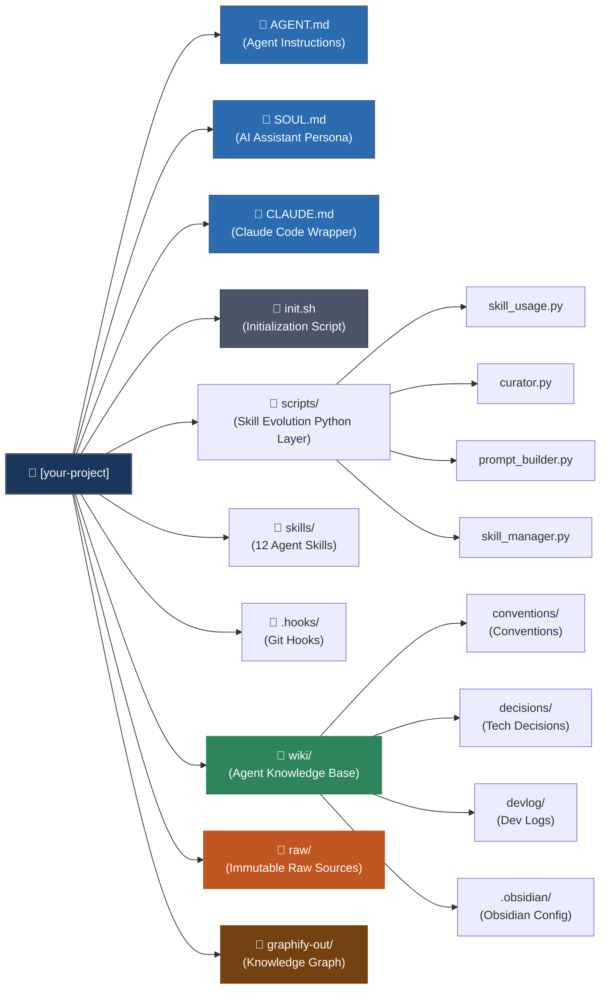

<p align="center">
  
</p>

# project-scaffold

> An LLM Wiki-based development harness template for any project built together with an AI agent

[](./AGENT.md)
[](https://www.gnu.org/software/bash/)
[](https://gist.github.com/karpathy/442a6bf555914893e9891c11519de94f)
[](https://obsidian.md)
[](https://python.org)


<p align="center">English | <a href="README.kr.md">한국어</a></p>

---

## Table of Contents

1. [Overview](#overview)
2. [Quick Start](#quick-start)
3. [Why We Built This](#why-we-built-this)
4. [What is LLM Wiki?](#what-is-llm-wiki)
5. [Inspired by Hermes Agent](#inspired-by-hermes-agent)
6. [How It Differs from oh-my-openagent](#how-it-differs-from-oh-my-openagent)
7. [Why Multi-Agent Compatibility Matters — The June 2026 Fable 5 Incident](#why-multi-agent-compatibility-matters--the-june-2026-fable-5-incident)
8. [System Architecture](#system-architecture)
9. [User vs System Role Separation](#user-vs-system-role-separation)
10. [Core Features](#core-features)
11. [Design Principles](#design-principles)
12. [Tool Integrations](#tool-integrations)
13. [Project Structure](#project-structure)
14. [Current Status](#current-status)

---

## Overview

project-scaffold is a GitHub template that builds an **AI agent harness** into a software development project.

AI agents are powerful, but without context they repeat the same mistakes every time. They don't know your team's conventions, can't recall past decisions, and have no code-review baseline to work from. project-scaffold solves this with a **living wiki that the agent reads and follows on its own**.

It's built on [the LLM Wiki pattern proposed by Andrej Karpathy](https://gist.github.com/karpathy/442a6bf555914893e9891c11519de94f): without RAG, a markdown wiki owned and maintained by the agent becomes the single source of truth for the whole project.

---

## Quick Start

### New Project

**1 — Create a new repo from the GitHub template, then clone it:**

```bash
git clone https://github.com/<your-name>/<your-project>.git
cd <your-project>
```

**2 — Initialize — pick mode 1, then choose your agent(s):**

```bash
bash init.sh
```

**3 — Open the project in your AI agent and start the interview:**

> Type this inside the AI chat (Claude Code, Cursor, etc.) — **not** in the terminal.

```
/setup
```

### Installing into an Existing Project

**1 — Clone project-scaffold as an install tool:**

```bash
git clone https://github.com/taejung3852/project-scaffold.git
cd project-scaffold
```

**2 — Initialize — pick mode 2, enter your project's path when prompted:**

```bash
bash init.sh
```

> When asked for the existing project path, enter the full path (e.g. `/Users/you/workspace/MyProject`). Do not just press Enter — that defaults to the project-scaffold directory itself.

**3 — Open your existing project in your AI agent and start the interview:**

> Type this inside the AI chat (Claude Code, Cursor, etc.) — **not** in the terminal.

```
/setup
```

Running `init.sh` lets you choose which AI agent(s) to wire up. Multiple selections are supported, and entering `all` applies every one of them.

| # | Agent | Skill path | Method |
|---|---|---|---|
| 1 | Claude Code | `.claude/skills/` | Symlink |
| 2 | Codex CLI | `.agents/skills/` | Symlink |
| 3 | Antigravity | `.agents/skills/` | Symlink (shares the path with Codex) |
| 4 | Windsurf | `.windsurf/skills/` | Symlink |
| 5 | Cursor | `.cursor/rules/` | Generates a converted `.mdc` |
| 6 | Continue.dev | `.continue/prompts/` | Generates a converted `.md` |
| 7 | Hermes | `~/.hermes/config.yaml` | Registers an external directory |
| 8 | Aider | `.aider.conf.yml` | Adds to the `read:` list |

To add or change agents later, just run `bash init.sh` again.

`/setup` preserves whatever categories are already complete if you stop partway through — pick it back up later.

---

## Why We Built This

### The Problem

The biggest barrier to adopting an AI coding agent on a real project is **"getting the agent to act like a member of your team."**

- Commit message format is different every time
- Architecture layer rules get ignored
- Implementation code gets written before any tests exist
- There's no way for the agent to know what was decided in the last meeting

Explaining all of this in the prompt every single time doesn't scale. It disappears the moment the conversation ends.

### The Solution

Document team conventions as a **structured wiki**, and have the agent read and follow that wiki on every task. Run the `/setup` interview to define the project's own rules, and a git hook blocks violations while devlogs accumulate automatically.

> **Core idea**: instead of making the agent memorize the rules, give it a place it can always go to read them.

---

## What is LLM Wiki?

LLM Wiki is a knowledge-management pattern proposed by Andrej Karpathy. ([Original Gist](https://gist.github.com/karpathy/442a6bf555914893e9891c11519de94f))

### Structure

It's made of three layers:

| Layer | Path | Owner | Role |
|---|---|---|---|
| **Raw** | `raw/` | Human | Immutable source material — meeting notes, decisions, articles, code snippets, etc. |
| **Wiki** | `wiki/` | AI agent | Structured knowledge compiled from the raw layer |
| **Schema** | `AGENT.md` | Human + AI | Defines the rules for agent behavior |

### Three Operations

- **Ingest**: add a new raw source → the agent generates a summary page, updates existing wiki pages, and maintains cross-references (wikilinks)
- **Query**: traverse wiki pages → synthesize an answer → valuable results get saved to `wiki/synthesis/`
- **Lint**: periodic health check → detect orphan pages, broken links, contradictions, stale information

### Why LLM Wiki Instead of RAG

> *"The source documents aren't re-retrieved every time. The knowledge gets compiled and maintained once, instead of being re-derived on every query."*
> — Andrej Karpathy

RAG vector-searches the source documents on every query, and the LLM repeats the same reasoning each time. LLM Wiki answers from a wiki that's already structured — the reasoning happens once, and the result accumulates in the wiki.

| | RAG | LLM Wiki |
|---|---|---|
| Knowledge storage | Vector DB (embeddings) | Markdown files (human-readable text) |
| When reasoning happens | On every query | Once, at ingest time |
| Cross-referencing | Similarity-based | Explicit `[[wikilink]]` |
| Maintenance | Requires re-indexing | Checked via `/wiki-lint` |
| Infrastructure | Vector DB server | Git repository |

### Why project-scaffold Adopted It

- A software team's conventions, decisions, and meeting notes don't change much once written down → RAG's re-retrieval advantage doesn't really apply
- An agent reading the conventions wiki directly is more accurate and trustworthy than something surfaced via vector similarity
- Git versioning gives you history tracking and team collaboration for free
- Running on markdown files alone, with no vector DB, means it works with any AI agent with zero ecosystem lock-in

---

## Inspired by Hermes Agent

[NousResearch](https://nousresearch.com/) is a research organization well known in the open-source AI community for fine-tuned model series like Hermes and Nous-Capybara. [NousResearch/hermes-agent](https://github.com/NousResearch/hermes-agent) is a **skill-based, self-evolving agent harness** built by that organization.

The core problem it addresses: the longer an agent is used, the more skills pile up, duplication creeps in, and usage patterns shift. **The skill ecosystem itself has to evolve.** Hermes solves this with four Python layers.

| Hermes Component | Role |
|---|---|
| `skill_usage.py` | Logs usage data to JSON on every skill invocation |
| `curator.py` | Reads usage data to decide stale/archive status and generate an evolution report |
| `prompt_builder.py` | Dynamically injects recommendations into the agent's instruction file based on usage patterns |
| `skill_manager.py` | CRUD for creating, archiving, and restoring skills |

**Why we adopted this mechanism:**

Skills are declarative `.md` files, agent-agnostic by nature — but deterministic logic like usage tracking, state transitions, and moving files around needs to be handled by actual code. Hermes's four-layer structure draws a clean line here: **the agent owns the declaration (`SKILL.md`), Python owns the judgment (`curator.py`)**.

project-scaffold adopted this structure as-is. The more skills get used, the more data piles up in `skills/.usage.json`, and `prompt_builder.py` auto-refreshes the recommendation section of `AGENT.md`. The `/curate` skill consolidating and cleaning things up via LLM judgment follows the same flow.

We also brought in Hermes's `SOUL.md` concept. In Hermes, SOUL.md defines the agent's persona — a permanent setting that doesn't change even when `/setup` rewrites `AGENT.md`. In project-scaffold, this is where **the personality you want your AI assistant to have** gets defined — tone, assumed expertise level, feedback style, how it should behave when uncertain. The assistant's personality survives even when the project underneath it changes.

---

## How It Differs from oh-my-openagent

[oh-my-openagent (OmO)](https://github.com/code-yeongyu/oh-my-openagent) is an open-source agent harness built by Korean developer code-yeongyu, who personally burned through roughly $24,000 worth of tokens testing every agent tool he could find. **Six months after it was created in December 2025, it had crossed 62,000+ GitHub stars**, and it's reportedly used by engineers at Google, Microsoft, and Vercel.

OmO's core innovations:
- **Hash-Anchored Edits** — attaching a content hash tag to every line, which pushed agent edit success rate from 6.7% to 68.3%
- **Ralph Loop** — self-referential orchestration that refuses to stop short of 100% completion
- **Multi-model team** — 11 specialized agents (Sisyphus/Claude, Hephaestus/GPT-5, Prometheus, Oracle, and others), each assigned the best-fit model per task category, running in parallel

Comparing OmO and project-scaffold:

| | oh-my-openagent (OmO) | project-scaffold |
|---|---|---|
| Direction | **Accelerator** — gives the agent broad tools and permissions | **Guardrail** — keeps agent misbehavior and rule violations in check |
| Target | Fast prototyping (solo devs / small teams) | Production teams |
| Knowledge management | None | LLM Wiki (`wiki/` layer) |
| Devlog | None | Auto-generated on every commit (post-commit hook) |
| Convention enforcement | None | Two layers: Hard (hook) + Soft (AGENT.md) |
| Harness neutrality | Built on the OpenCode harness (Claude Code gets a separate compatibility layer) | `AGENT.md` is the single source — works across 8 agents: Claude Code, Codex, Antigravity, Windsurf, Cursor, Continue.dev, Hermes, Aider |

If OmO is an **agent OS layer** — you specify "what to build" and a team of agents autonomously divides up the work — project-scaffold is a **project-knowledge layer** that mechanically guarantees team conventions, records, and verification no matter which agent you're running. They sit at different layers, so you can use both at once.

---

## Why Multi-Agent Compatibility Matters — The June 2026 Fable 5 Incident

project-scaffold's decision to support 8 AI agents (Claude Code, Codex, Antigravity, Windsurf, Cursor, Continue.dev, Hermes, Aider) through a single `AGENT.md` wasn't a matter of taste. It was prompted by something that actually happened.

### What Happened

- **2026-06-09**: Anthropic released its newest models, Claude Fable 5 and Mythos 5
- **2026-06-12, 5:21 PM ET**: citing national security authorities, the US government issued an export control directive ordering Anthropic to "suspend all access to Fable 5 and Mythos 5 by any foreign national, whether inside or outside the United States, including foreign national Anthropic employees"
- Anthropic disagreed with the directive but complied. **Every other Claude model (Opus, Sonnet, Haiku, etc.) was unaffected**
- The government's letter didn't disclose specific grounds, but Anthropic's understanding was that the government had become aware of a way to bypass, or "jailbreak," Fable 5. In its official statement, Anthropic pushed back directly: *"We disagree that the finding of a narrow potential jailbreak should be cause for recalling a commercial model deployed to hundreds of millions of people,"* adding that holding the entire industry to that standard "would essentially halt all new model deployments for all frontier model providers"
- The order landed just three days after launch. Anthropic said it believed the action stemmed from a misunderstanding and was working to restore access as quickly as possible

### Implications

What this incident shows is that **tying your team's entire workflow to a single vendor or a single model means one external factor you have no control over — government policy, export controls, a change in service terms — can stop your productivity cold, overnight.** For developers based outside the US, including Korea, the risk is even more direct: it wasn't model performance or price that decided access — it was nationality itself.

This is exactly why project-scaffold keeps `AGENT.md` as the single source of truth for every agent, with nothing but a one-line wrapper file (`CLAUDE.md`, `.cursorrules`, etc.) per agent on top of it. If access to a particular model or agent gets cut off, your team's conventions and working context stay intact in `AGENT.md`, and you can switch to a different agent immediately just by swapping the wrapper file. Vendor lock-in isn't an abstract worry — it's something that actually happens. Tools like [cc-switch](https://github.com/farion1231/cc-switch) make the switching itself frictionless — project-scaffold ensures that whatever agent you switch to already knows your project.

### Sources

- [Anthropic — Statement on the US government directive to suspend access to Fable 5 and Mythos 5](https://www.anthropic.com/news/fable-mythos-access)
- [Anthropic (official X account) — thread posted shortly after the directive](https://x.com/AnthropicAI/status/2065597531644743999)
- [CNN Business — Anthropic suspends all access to Mythos model after US government bans foreign nationals use](https://www.cnn.com/2026/06/13/business/anthropic-mythos-model-national-security)
- [Bloomberg — Anthropic Says US Orders Halt to Foreign Access for Fable 5, Mythos 5 AI Models](https://www.bloomberg.com/news/articles/2026-06-13/anthropic-says-us-limits-foreign-access-to-fable-5-mythos-5)
- [Fortune — Anthropic disables Fable and Mythos AI models after U.S. government bars it from giving foreigners access](https://fortune.com/2026/06/13/anthropic-disables-fable-mythos-export-controls-national-security-threat/)

---

## System Architecture

Made up of 12 skills, 4 Python scripts, 2 git hooks, and a dual source of truth: `AGENT.md` + `SOUL.md`.

```text
User
  │
  ├─ /setup      ─── generates wiki/conventions/ (14 pages) + AGENT.md + SOUL.md
  ├─ /capture    ─── saves to raw/ (meetings · decisions)
  ├─ /devlog     ─── session-aware dev log (auto-drafts from git + conversation context)
  ├─ /ingest     ─── raw/ → wiki/ integration
  ├─ /query      ─── wiki/-grounded Q&A
  ├─ /report     ─── meetings/interviews/ADRs/sprints → internal notes + team-shared doc
  ├─ /code-lint  ─── code verification against wiki/conventions/
  ├─ /wiki-lint  ─── wiki/ quality check
  ├─ /dashboard  ─── project status dashboard
  ├─ /curate     ─── skill evolution curator (consolidate · archive · propose)
  ├─ /help       ─── full skill list, role classification, getting-started flow
  └─ /handoff    ─── save/restore session context across sessions

git commit
  ├─ pre-commit  ─── .hooks/convention-check.sh (security & static analysis)
  └─ post-commit ─── .hooks/devlog-auto.sh (auto-generates raw/dev-logs/)

Automatic loop on every skill run
  ├─ skill_usage.py    ─── updates skills/.usage.json
  └─ prompt_builder.py ─── auto-refreshes AGENT.md's recommendation section

AGENT.md  ─── per-project agent instructions (created/updated by /setup)
SOUL.md   ─── developer's AI assistant persona (project-agnostic, permanent)
```

---

## User vs System Role Separation

> Developers should be free to just focus on developing. The system handles the repetitive work.

### What the User Runs Directly

| Skill | When | Note |
|---|---|---|
| `/setup` | Define conventions at project kickoff | Once, at the start |
| `/capture` | Record meetings and decisions | Auto-suggests running `/ingest` right after |
| `/devlog` | Session-aware dev log | Drafts from git log + conversation; confirm or fill gaps only |
| `/ingest` | Apply raw/ files into the wiki | Auto-suggested when `/capture` finishes |
| `/query` | Wiki-grounded Q&A | As needed |
| `/report` | Generate meeting notes / ADR / sprint summaries | As needed |
| `/code-lint` | Convention-based code review | Before a PR |
| `/help` | Check the skill list, role classification, getting-started flow | When new to the harness, or unsure what to use |
| `/handoff` | Save/restore session context across sessions | When ending or starting a session |

### Agent Suggests, User Confirms Before Running

You don't need to remember or track any of these yourself. At the start of a session, the agent checks the conditions and, only if one is met, makes a one-line suggestion.

| Skill | Trigger condition |
|---|---|
| `/dashboard` | 7+ days since the last refresh |
| `/wiki-lint` | 14+ days since the last run |
| `/curate` | Stale skills piling up, or 50+ total invocations |
| `/code-lint` | Push/PR intent detected and not yet run on this change |

### What the System Handles Automatically

| Trigger | Action | Owner |
|---|---|---|
| `git commit` | Security & static-analysis check — blocks the commit on a violation | `pre-commit` hook |
| `git commit` | Logs commit message + changed files to `raw/dev-logs/` | `post-commit` hook |
| On every skill run | Updates `skills/.usage.json` | `skill_usage.py` |
| On every skill run | Auto-refreshes the recommendation section of `AGENT.md` | `prompt_builder.py` |

---

## Core Features

### `/setup` — Initial Project Interview

A 2-3 hour deep interview that defines conventions across 14 categories and auto-generates the `wiki/conventions/` pages plus `SOUL.md`.

**14 interview categories:**

| # | Category | Output |
|---|---|---|
| 1 | Project overview | `wiki/conventions/01-project-overview.md` |
| 2 | Tech stack | `wiki/conventions/02-tech-stack.md` |
| 3 | Naming conventions | `wiki/conventions/03-naming.md` |
| 4 | Git conventions | `wiki/conventions/04-git.md` |
| 5 | Architecture rules | `wiki/conventions/05-architecture.md` |
| 6 | TDD rules | `wiki/conventions/06-tdd.md` |
| 7 | Devlog template | `wiki/conventions/07-devlog.md` |
| 8 | HITL risk criteria | `wiki/conventions/08-hitl-risk.md` |
| 9 | Dashboard settings | `wiki/conventions/09-dashboard.md` |
| 10 | Code review checklist | `wiki/conventions/10-code-review.md` |
| 11 | Error handling | `wiki/conventions/11-error-handling.md` |
| 12 | Security conventions | `wiki/conventions/12-security.md` |
| 13 | Dependency management | `wiki/conventions/13-dependencies.md` |
| 14 | AI assistant persona | `SOUL.md` (project-agnostic, permanent) |

`AGENT.md` is auto-generated once every category is complete. Each category is saved as its own file, so progress survives if the interview gets interrupted.

**Built-in ambiguity-check:**
Every answer has to clear 4 criteria (specificity, actionability, exemplifiability, completeness) before moving to the next question. Vague phrases like "as appropriate" or "if needed" trigger an immediate follow-up. Only rules the agent can follow with no further questions get written into the wiki.

---

### `/capture` — Capture Meetings, Decisions, and Dev Work

Saves important content that comes up during work to `raw/`.

| Type | Storage path | Use |
|---|---|---|
| `meeting` | `raw/meetings/` | Meeting content, decisions, action items |
| `decision` | `raw/decisions/` | Architecture/technical decisions, trade-offs, revisit conditions |

Saved files get `ingest_status: "⏳ pending"`, which `/ingest` automatically detects.

For dev-logs, use `/devlog` instead.

---

### `/devlog` — Session-Aware Dev Log

Unlike `/capture`, which saves content as-is, `/devlog` reads the current session first — git log, changed files, conversation context — and drafts a dev-log entry before asking anything.

```text
Auto-collect: git log (today) + changed files + conversation context
  → Claude drafts all 5 fields (title, what was done, blockers, next steps, learnings)
  → Show draft with ✅ (confident) / ❓ (needs confirmation) markers
  → User confirms or fills in gaps only
  → Save to raw/dev-logs/YYYY-MM-DD_dev-log_<slug>.md
  → Offer to run /ingest
```

Questions come with Claude's best guess pre-filled. If a field can't be inferred, it's left blank — never forced.

---

### `/ingest` — Automatic Wiki Integration

Integrates a raw source across the entire wiki. A single source can touch 10-15 pages.

```text
Read the raw/ file
  → generate a source-summary page (wiki/sources/)
  → update related conventions/decisions/devlog pages
  → backlink audit (add any missing wikilinks)
  → refresh wiki/index.md
  → log it in wiki/log.md
  → flip raw/ ingest_status → "✅ done"
  → run `graphify update wiki/` if Graphify is installed (prompts to install if it isn't — never skips silently)
```

When a contradiction turns up, nothing gets overwritten — both sources are cited and flagged with a `> ⚠️ Contradiction` block.

---

### `/query` — Wiki-Grounded Q&A

Answers questions like "where do test files go?" or "am I allowed to use this package?" by grounding the answer in the wiki.

```text
Check graphify-out/graph.json first — if present, narrow down to related docs through the graph (prompts to install Graphify if it's missing — never skips silently)
  → read wiki/index.md (get the full page map) as the fallback
  → read the relevant pages (priority order: conventions → decisions → devlog)
  → synthesize an answer with [[wikilink]] citations
  → fall back to raw/ for extra detail if needed
  → save good answers to wiki/synthesis/
```

Answer quality improves as more sources accumulate.

---

### `/code-lint` — Convention-Based Code Review

**Two-layer verification**: combines static-analysis tooling with LLM context review.

| Layer | Tool | Role |
|---|---|---|
| Static analysis | pylint / mypy / eslint | Syntax/type errors, code quality |
| LLM review | Grounded in `wiki/conventions/` | Naming/architecture/security/TDD context violations |

The LLM reads `wiki/conventions/` and judges against the team's own rules — catching **semantic and architectural violations** that static tools can't see.

🔴 On finding a violation, it only proceeds after HITL confirmation. It never auto-fixes anything.

---

### `/wiki-lint` — Wiki Quality Check

| Detection target | Description |
|---|---|
| Orphan pages | Pages with zero inbound wikilinks |
| Broken wikilinks | `[[links]]` pointing at files that don't exist |
| Missing backlinks | A mentions B, but B never references A back |
| Unresolved contradictions | Pages carrying a `> ⚠️ Contradiction` block |
| Stale pages | Pages whose `updated` date is 90+ days old |
| Missing frontmatter | Required fields are absent |

Reports only — it never auto-fixes. Whether to fix anything is left to the user.

---

### `/dashboard` — Project Status Dashboard

Pulls together today's tasks, milestone progress, and recent devlogs into a single view.

**3 render modes (built in order, A→B→C):**

| Mode | Command | Output |
|---|---|---|
| markdown | `/dashboard` | Refreshes `wiki/dashboard.md` |
| terminal | `/dashboard term` | ANSI-colored terminal output |
| web | `/dashboard web` | `wiki/dashboard.html` → opens in browser |

Wired into the commit hook (`devlog-auto.sh`), so `wiki/dashboard.md` auto-refreshes on every commit.

---

### `/report` — Generate Reports

Takes meeting/interview/sprint/technical-decision content and turns it into whichever document fits the purpose.

**4 types:**

| Type | Description |
|---|---|
| Meeting notes | Regular team meetings, planning meetings |
| Interview report | Deep interviews with users/customers/teammates |
| ADR | Architecture Decision Record — a technical decision document |
| Sprint summary | Sprint retrospective/planning |

**2 output modes:**

| Mode | Content | Storage path |
|---|---|---|
| **Internal notes** | Detailed insights, open questions, subjective interpretation included | `wiki/meetings/[date]_[slug]_internal.md` |
| **Team-shared** | Decisions, action items, owner-focused shared document | `wiki/meetings/[date]_[slug]_shared.md` |

If you pick both, both files get generated at once, and the team-shared version is also printed as a markdown block so it can be pasted straight into Slack or Notion.

---

### `/curate` — Skill Evolution Curator

The more skills pile up, the more duplication appears and the more usage patterns shift. `/curate` ports Hermes Agent's self-evolution mechanism into the Claude Code environment.

**Two-stage operation:**

```text
python3 scripts/curator.py report   ← Python: stale/archive judgment from usage data
  └─ LLM clustering analysis        ← Claude: judges skill consolidation / new-skill proposals
       └─ Runs only after HITL confirmation  ← Human: final call
```

| Judgment | Criterion | Action |
|---|---|---|
| stale | Unused for 30 days | Flagged as a recommendation |
| archive | Unused for 90 days | Moved to `skills/.archive/` |
| consolidate | Functional duplication detected | Proposes merging the SKILL.md files |
| new | Repeated pattern detected | Proposes creating a new skill |

Every SKILL.md includes a `skill_usage.py track` call, so running a skill updates `skills/.usage.json`, and `prompt_builder.py` uses that to auto-update the recommendation section of `AGENT.md`. The agent reads the refreshed AGENT.md in the next session and its behavior changes accordingly.

---

### `/help` — Harness Usage Guide

The more skills pile up, the easier it is to lose track of what to use and when. `/help` puts this project's current skill setup on one screen, with no need to go dig through the README.

```text
Scan the skills/ directory for real (no hardcoding)
  → collect each SKILL.md's description
  → print it classified into 3 categories: direct / agent-suggested / system-automatic
  → check whether wiki/conventions/ exists
       if not        → recommend starting with "/setup"
       if it exists   → print the recommended flow: /capture → /ingest → /query → /code-lint
```

If a skill turns up that isn't in the classification table, it's flagged "🆕 unclassified" to prompt a README update — it never guesses a category on its own.

---

### `/handoff` — Session Handoff

Compresses the current conversation into a resumable note for the next session (or a different agent), and saves it to `raw/handoffs/`.

| Mode | Trigger | Action |
|---|---|---|
| save | `/handoff save [next-session focus]` | Summarize the conversation + git context, then save |
| load | `/handoff load` | Restore the most recent save |
| list | `/handoff list` | List saved handoffs |
| clean | `/handoff clean [days]` | Remove handoffs older than N days (requires confirmation) |

Content already captured elsewhere (PRs, commits, decision docs) is referenced by path/URL instead of being repeated. Sensitive information — API keys, tokens, PII — gets redacted before saving.

Not picked up by `/ingest` — it's an operational record, not knowledge meant for the wiki.

---

### `SOUL.md` — AI Assistant Persona

Inspired by Hermes Agent's `SOUL.md` concept. A file that defines the agent's fixed identity — it doesn't change even when `/setup` rewrites `AGENT.md` for a new project.

What it defines: tone (formal/informal), assumed level of expertise, feedback style, behavior under uncertainty, and language setting.

`AGENT.md` references it via `@SOUL.md`, so the assistant's persona is always loaded.

---

### git hooks

**pre-commit — `.hooks/convention-check.sh`**
- Detects hardcoded secrets (password, api_key, secret patterns)
- Static analysis via pylint / eslint (only if installed)
- Blocks the commit when a violation is found

**post-commit — `.hooks/devlog-auto.sh`**
- Auto-saves the commit message + list of changed files to `raw/dev-logs/YYYY-MM-DD_dev-log_auto.md`
- Appends to the existing file if it's the second-or-later commit that day

---

## Design Principles

### Agent-Agnostic

A single `AGENT.md` is the source of truth for every AI agent. When you swap agents, `AGENT.md` stays exactly as it is — only the wrapper file changes.

| Agent | Config file | Content |
|---|---|---|
| Claude Code | `CLAUDE.md` | `@AGENT.md` |
| Cursor | `.cursorrules` | `@AGENT.md` |
| Continue | `.continuerc` | `@AGENT.md` |

### Two-Layer Enforcement

- **Soft (agent layer)**: `AGENT.md` always references TDD/security rules — the agent reads and follows the relevant conventions page for every task
- **Hard (hook layer)**: `.hooks/convention-check.sh` runs static checks against `wiki/conventions/` on every commit

### Knowledge Compounding

```text
raw/ → /ingest → wiki/ → /query → wiki/synthesis/
```

The thicker the wiki gets, the more trustworthy the agent's answers become. The agent writes the wiki; the human reads it.

### raw/ Immutability

Every file in `raw/` is preserved exactly as it was originally written. The AI only ever reads it. The `ingest_status` field is the one exception allowed to be modified.

---

## Tool Integrations

`wiki/` is plain markdown, so it isn't tied to any particular editor or viewer. The tools below are optional, but using them changes the experience considerably.

### Obsidian — Wiki Visualization for Humans

The `wiki/` folder created after running `init.sh` can be opened directly as an [Obsidian](https://obsidian.md) vault. The `wiki/.obsidian/` folder is generated automatically, so the features below work immediately with zero configuration.

| Feature | Benefit |
|---|---|
| **Graph view** | Conventions/decisions/devlogs linked via `[[wikilink]]` render as a visual knowledge map |
| **Backlinks panel** | Instantly see, e.g., how many decisions reference a given naming convention |
| **Folder color groups** | conventions/decisions/devlog/meetings folders are color-coded so the structure is obvious at a glance |
| **Native markdown** | Files the agent generates can be read and edited by a human directly, with no conversion step |

> The agent writes the wiki; the human reads it through Obsidian. Since the wiki is version-controlled with git, the whole team shares the exact same view.

It works in any markdown-capable editor — VS Code, Typora, you name it.

---

### Graphify — A Knowledge Graph for AI

[Graphify](https://graphify.net/) is an open-source knowledge-graph tool for AI coding assistants. It parses `wiki/` using Tree-sitter AST + LLM semantic extraction + Leiden clustering to produce a queryable graph.

`init.sh` auto-detects whether graphify is installed and handles AI-agent registration as well. If it isn't installed, you'll just get a guidance message instead.

Update the graph whenever you update the wiki:

```bash
graphify update wiki/
```

`graphify-out/` is a locally generated artifact, included in `.gitignore`. It's a tool for feeding your own wiki context to an AI efficiently — it's not something you share with teammates.

```text
graphify-out/
├── graph.html        ← interactive visualization
├── GRAPH_REPORT.md   ← key nodes, surprising connections, suggested questions to explore
└── graph.json        ← queryable graph
```

| Problem | How Graphify Solves It |
|---|---|
| Loading the whole wiki every time wastes tokens | Querying graph.json instead gives a **71.5× token reduction** |
| Context resets when the session ends | Persisted and reused from graphify-out/ |
| Hard to see how wiki files connect to each other | Detects God Nodes and Surprise Edges |
| Concern about sending source code off-machine | Only semantic descriptions are sent, never source code (MIT license) |

| Tool | Audience | Role |
|---|---|---|
| **Obsidian** | Human | GUI for browsing/editing wiki/ (graph view) |
| **Graphify** | AI agent | Knowledge graph over wiki/ + code (token-efficient queries) |

---

## Project Structure



<details>
<summary>📂 Click to expand the full directory tree structure</summary>

```
[your-project]/
├── AGENT.md                        ← per-project agent instructions (created/updated by /setup)
├── SOUL.md                         ← AI assistant persona (developer's permanent setting, untouched by /setup)
├── CLAUDE.md                       ← @AGENT.md (one-line wrapper for Claude Code)
├── init.sh                         ← initialization script (run once, right after cloning)
│
├── scripts/                        ← skill-evolution Python layer (Hermes-style)
│   ├── skill_usage.py              ← tracks skill invocations → updates skills/.usage.json
│   ├── curator.py                  ← stale/archive judgment + evolution report
│   ├── prompt_builder.py           ← usage patterns → auto-refreshes AGENT.md's recommendation section
│   └── skill_manager.py            ← skill CRUD (create/archive/restore/delete)
│
├── skills/
│   ├── setup/
│   │   ├── SKILL.md                ← 14-category interview flow
│   │   └── ambiguity-check.md      ← ambiguity-evaluation sub-skill
│   ├── capture/SKILL.md            ← capture meetings/decisions
│   ├── devlog/SKILL.md             ← session-aware dev log (auto-drafts from git + conversation)
│   ├── ingest/SKILL.md             ← raw/ → wiki/ integration
│   ├── query/SKILL.md              ← wiki-grounded Q&A
│   ├── report/SKILL.md             ← meetings/interviews/ADR → internal notes + team-shared
│   ├── code-lint/SKILL.md          ← convention-based code review
│   ├── wiki-lint/SKILL.md          ← wiki quality check
│   ├── dashboard/SKILL.md          ← dashboard rendering
│   ├── curate/SKILL.md             ← skill evolution curator (LLM judgment layer)
│   ├── help/SKILL.md               ← harness usage guide (skill list, getting-started flow)
│   ├── handoff/SKILL.md            ← save/restore session context across sessions
│   ├── .usage.json                 ← skill usage tracking data
│   └── .archive/                   ← storage for skills unused for 90+ days
│
├── .hooks/
│   ├── convention-check.sh         ← pre-commit: security & static-analysis check
│   └── devlog-auto.sh              ← post-commit: auto-generates the dev-log
│
├── wiki/                           ← knowledge base owned and maintained by the agent
│   ├── conventions/                ← convention pages generated by /setup (13 + SOUL.md separately)
│   ├── decisions/                  ← architecture/technical decision records
│   ├── devlog/                     ← development progress log
│   ├── meetings/                   ← meeting notes
│   ├── sources/                    ← raw-source summary pages
│   ├── synthesis/                  ← synthesized analysis pages
│   ├── index.md                    ← full wiki catalog
│   ├── log.md                      ← operation log
│   └── dashboard.md                ← project status dashboard
│
├── raw/                            ← immutable raw sources (read-only)
│   ├── meetings/
│   ├── decisions/
│   ├── dev-logs/
│   └── ideas/
│
├── wiki/.obsidian/                 ← Obsidian config (auto-generated when init.sh runs)
│
└── graphify-out/                   ← Graphify output (graph.html · GRAPH_REPORT.md · graph.json)
```

</details>

---

## Current Status

| Item | Status |
|---|---|
| 12 skill files (setup·capture·devlog·ingest·query·report·code-lint·wiki-lint·dashboard·curate·help·handoff) | ✅ Done |
| ambiguity-check sub-skill | ✅ Done |
| 2 git hooks (convention-check·devlog-auto) | ✅ Done |
| init.sh — multi-agent selection + automatic path setup (8 agents supported) | ✅ Done |
| SKILL.md `description` frontmatter (compatible with each agent's autonomous invocation) | ✅ Done |
| AGENT.md template | ✅ Done |
| SOUL.md template | ✅ Done |
| 4 skill-evolution Python layers (skill_usage·curator·prompt_builder·skill_manager) | ✅ Done |
| `.obsidian/` folder (Obsidian color groups pre-configured) | ✅ Done |
| Graphify integration (`pip install graphifyy` + `graphify install`) | ✅ Done |
| AutoDoc MAS v2 dogfooding | 🚧 In Progress |

---

## Inspiration

- [Andrej Karpathy — the LLM Wiki pattern (GitHub Gist)](https://gist.github.com/karpathy/442a6bf555914893e9891c11519de94f) — the `raw/`/`wiki/`/`AGENT.md` three-layer structure; a RAG-free, markdown-based knowledge-management pattern
- [NousResearch/hermes-agent](https://github.com/NousResearch/hermes-agent) — the four-layer skill-usage-tracking/auto-evolution system (`skill_usage.py`·`curator.py`·`prompt_builder.py`·`skill_manager.py`), the `SOUL.md` persona concept
- [walkinglabs/awesome-harness-engineering](https://github.com/walkinglabs/awesome-harness-engineering) — the agent + skills + orchestrator three-part design principle
- [code-yeongyu/oh-my-openagent](https://github.com/code-yeongyu/oh-my-openagent) — an accelerator-direction harness; project-scaffold's guardrail direction was defined in contrast to it
- [graphify.net (Graphify)](https://graphify.net/) — a knowledge-graph skill for AI coding assistants, integrated here as the wiki/ visualization layer
